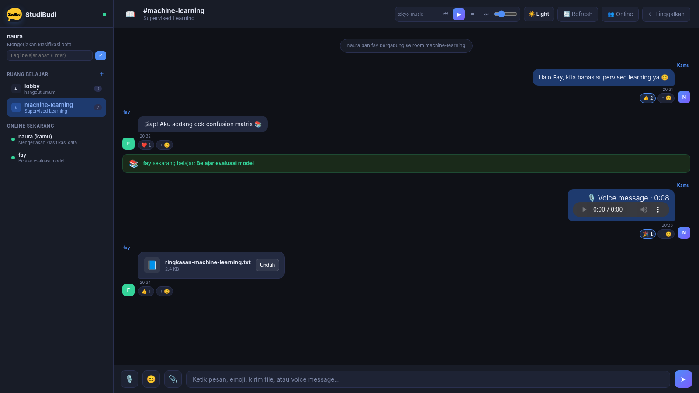
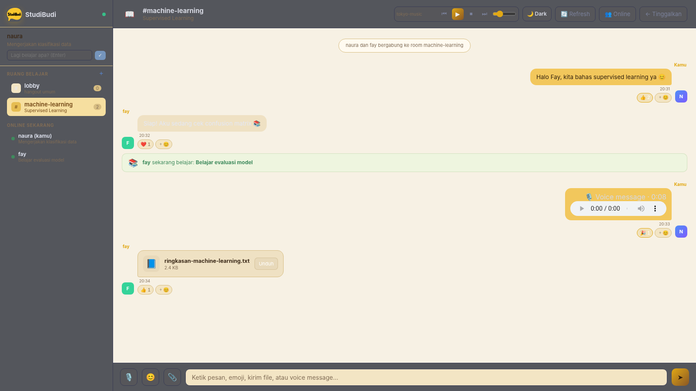
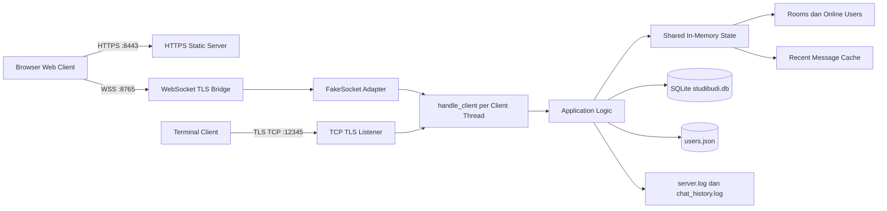
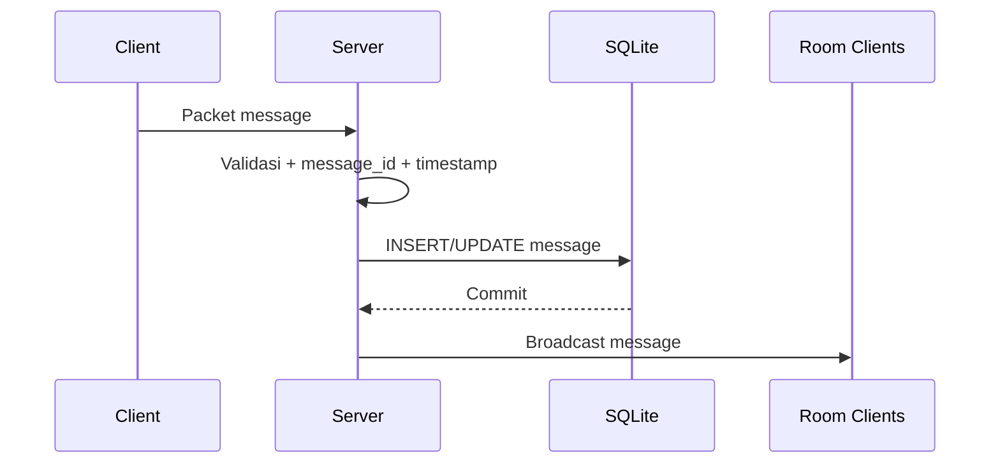
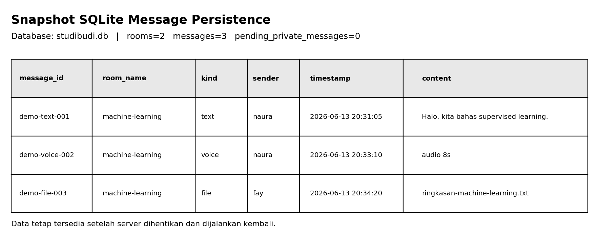
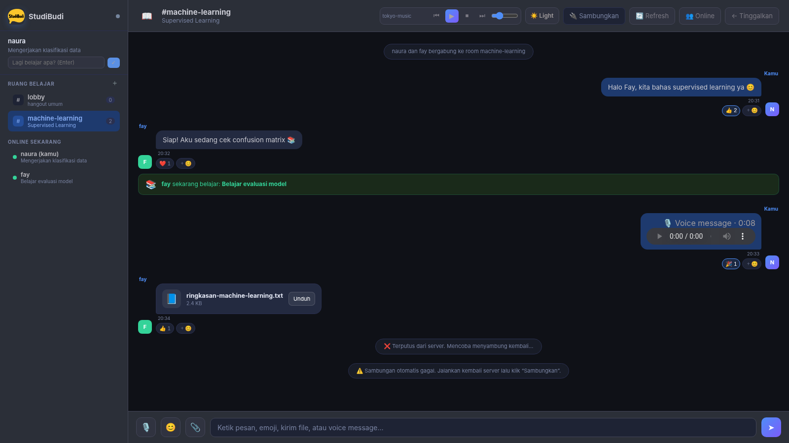
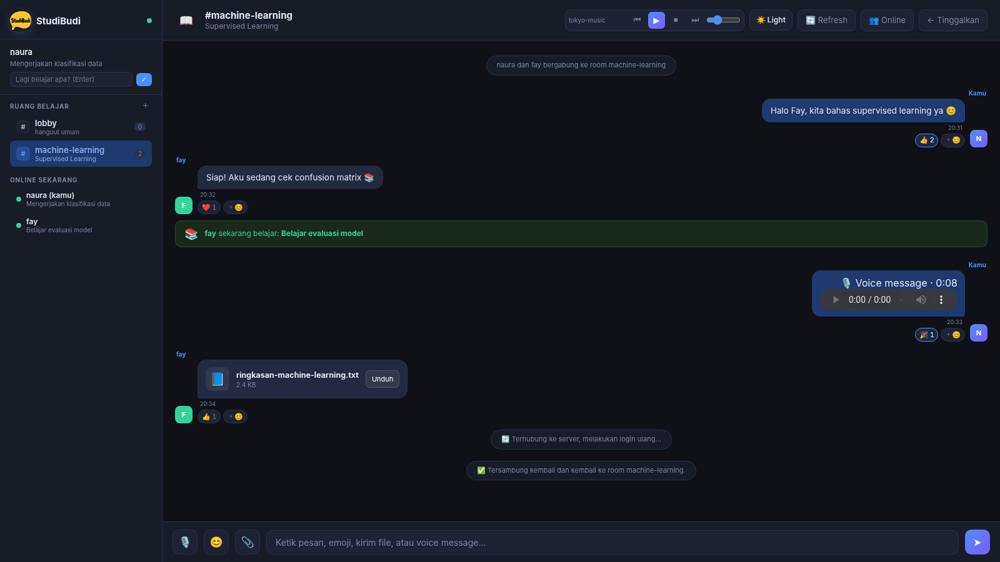
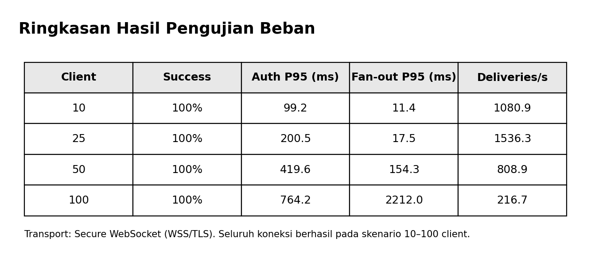
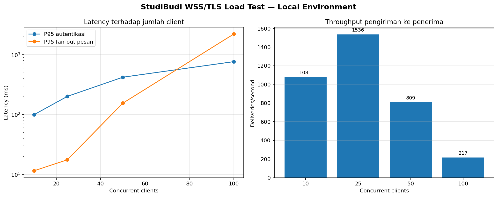

[](https://classroom.github.com/a/4SHtB1vz)
<div align="center">
  

## **Link Youtube** : https://youtu.be/NWsvA2BoB1Y?si=bai0fWHJ31HoK0he
# StudiBudi

### Topic-Based Multi-Chat Room Platform for Students

Aplikasi chat berbasis jaringan yang membantu mahasiswa menemukan teman belajar, membagikan status belajar, membuat room diskusi berdasarkan topik, serta berkomunikasi melalui pesan teks, private message, voice message, file, emoji, dan reaction secara real-time.


</div>

---

## Daftar Isi

1. [Informasi Kelompok](#informasi-kelompok)
2. [Deskripsi Project](#deskripsi-project)
3. [Tujuan Project](#tujuan-project)
4. [Status Pemenuhan Ketentuan](#status-pemenuhan-ketentuan)
5. [Fitur Aplikasi](#fitur-aplikasi)
6. [Snapshot Antarmuka](#snapshot-antarmuka)
7. [Teknologi yang Digunakan](#teknologi-yang-digunakan)
8. [Struktur Folder](#struktur-folder)
9. [Instalasi dan Menjalankan Program](#instalasi-dan-menjalankan-program)
10. [Alur Kerja Aplikasi](#alur-kerja-aplikasi)
11. [Arsitektur Sistem](#arsitektur-sistem)
12. [Desain Protokol Aplikasi](#desain-protokol-aplikasi)
13. [Command Aplikasi](#command-aplikasi)
14. [Database Message Persistence](#database-message-persistence)
15. [Encryption dan TLS](#encryption-dan-tls)
16. [Multithreading dan Concurrency Handling](#multithreading-dan-concurrency-handling)
17. [Logging](#logging)
18. [Simulasi Koneksi dan Putus Koneksi](#simulasi-koneksi-dan-putus-koneksi)
19. [Pengujian Fungsional](#pengujian-fungsional)
20. [Pengujian Performa dan Beban Server](#pengujian-performa-dan-beban-server)
21. [Hasil dan Analisis](#hasil-dan-analisis)
22. [Kendala dan Solusi](#kendala-dan-solusi)
23. [Keterbatasan Sistem](#keterbatasan-sistem)
24. [Kesimpulan dan Saran](#kesimpulan-dan-saran)

---

## Informasi Kelompok

**Kelompok 14**

| No. | Nama | NRP |
|---:|---|---:|
| 1 | Erica Triana Widyastuti | 5025241069 |
| 2 | Fayza Lathifah Humam | 5025241094 |
| 3 | Naura Taqiyya Mazi | 5025241119 |

---

## Deskripsi Project

**StudiBudi** adalah aplikasi multi-chat-room berbasis jaringan untuk mahasiswa. Pengguna dapat membuat akun sederhana, menampilkan status belajar, melihat pengguna yang sedang online, membuat atau bergabung ke room berdasarkan topik, dan berdiskusi secara real-time.

Project dibangun menggunakan arsitektur **client-server** dengan implementasi utama berupa:

- **TCP socket** untuk terminal client;
- **Secure WebSocket (WSS)** untuk web client;
- **HTTPS** untuk menyajikan antarmuka web;
- **multithreading** untuk menangani banyak koneksi client;
- **JSON serialization** sebagai format pertukaran data;
- **SQLite** untuk menyimpan room dan message secara persisten;
- **TLS** untuk mengenkripsi komunikasi selama transmisi.

StudiBudi tidak hanya menyediakan pesan teks, tetapi juga private message, voice message, file transfer, emoji, reaction, playlist lofi, light/dark mode, reconnect otomatis, dan penyimpanan history ke database.

---

## Tujuan Project

Project ini bertujuan menerapkan materi Pemrograman Jaringan ke dalam sistem yang lebih kompleks, khususnya:

1. Mengimplementasikan konsep client-server.
2. Menggunakan TCP socket dan WebSocket sebagai media komunikasi.
3. Merancang protokol application layer sendiri.
4. Melakukan parsing dan serialization data jaringan.
5. Melayani banyak client menggunakan multithreading.
6. Menangani shared state secara aman dengan concurrency control.
7. Mengimplementasikan logging server.
8. Menguji stabilitas, latency, throughput, dan beban server.
9. Mengamankan koneksi dengan TLS.
10. Menyimpan message secara persisten menggunakan database.

---

## Status Pemenuhan Ketentuan

### Ketentuan Utama

| Ketentuan | Implementasi | Status |
|---|---|:---:|
| Mendukung banyak room | Room disimpan dalam shared state dan tabel `rooms` | ✅ |
| Satu room dapat berisi banyak client | Setiap room menyimpan daftar username anggota | ✅ |
| Create room | Command `/create <room> <topic>` | ✅ |
| Join room | Command `/join <room>` | ✅ |
| Leave room | Command `/leave` | ✅ |
| Broadcast message | Pesan dikirim ke semua socket anggota room aktif | ✅ |
| Private message | Command `/msg <user> <message>` | ✅ |
| Menggunakan TCP socket | TLS TCP pada port `12345` | ✅ |
| Menggunakan multithreading atau select | Satu thread handler untuk setiap client | ✅ |
| Semua message menggunakan serialization | JSON Lines dan JSON WebSocket frame | ✅ |

### Fitur Wajib

| Fitur Wajib | Implementasi | Status |
|---|---|:---:|
| Authentication sederhana | Username dan hash password disimpan di `users.json` | ✅ |
| Online user list | Daftar user online beserta status belajar | ✅ |
| Room list | Nama room, topik, dan jumlah anggota | ✅ |
| Chat history | Lima pesan terakhir saat user masuk room | ✅ |
| Timestamp message | Timestamp dibuat server | ✅ |
| Server logging | `server.log` dan `chat_history.log` | ✅ |

### Fitur Bonus

| Fitur Bonus | Implementasi | Status |
|---|---|:---:|
| File transfer | File maksimal 4 MB dikirim sebagai Base64 | ✅ |
| Voice chat sederhana | Voice message maksimal 60 detik | ✅ |
| Emoji/reaction | Emoji picker dan reaction real-time | ✅ |
| Encryption/TLS | HTTPS, WSS, dan TLS TCP | ✅ |
| Database message persistence | SQLite `studibudi.db` | ✅ |

> **Catatan voice chat:** implementasi yang digunakan adalah **voice message berbasis rekaman**, bukan panggilan suara real-time seperti video conference.

---

## Fitur Aplikasi

### 1. Authentication Sederhana

- User memasukkan username dan password.
- Apabila username belum terdaftar, akun dibuat otomatis.
- Password tidak disimpan dalam bentuk plain text, tetapi di-hash menggunakan SHA-256.
- Username yang sedang login tidak dapat digunakan oleh client lain secara bersamaan.
- Hasil autentikasi dikirim melalui packet `auth_result`.

### 2. Multi-Chat Room

Pengguna dapat:

- melihat daftar room;
- membuat room dengan nama dan topik;
- bergabung ke room;
- keluar dari room dan kembali ke lobby;
- melihat jumlah anggota room;
- menerima lima message terakhir ketika masuk room.

### 3. Broadcast Message

Pesan biasa yang dikirim tanpa command akan dibroadcast ke seluruh anggota room aktif. Pengguna di room lain tidak menerima pesan tersebut.

### 4. Private Message

Format:

```text
/msg <username> <message>
```

Contoh:

```text
/msg fay Tolong kirim materi evaluasi model
```

Apabila penerima sedang online, pesan dikirim langsung. Jika penerima sedang offline, pesan masuk ke tabel `pending_private_messages` dan dikirim ketika user login kembali.

### 5. Online User List dan Status Belajar

Daftar **Online Sekarang** menampilkan:

- username;
- penanda akun sendiri;
- status belajar saat ini.

Status dapat diperbarui melalui kolom status atau command:

```text
/status Mengerjakan klasifikasi data
```

### 6. Chat History

- Server menyimpan semua message ke SQLite.
- Ketika startup, server memuat maksimal 20 message terbaru per room ke memori.
- Ketika user melakukan `/join`, server mengirim lima message terbaru sebagai history.
- History dapat berisi text, voice message, dan file.
- Private message tidak ditampilkan dalam room history.

### 7. File Transfer

- Tombol `📎` digunakan untuk memilih file.
- Ukuran file maksimal **4 MB**.
- File dikonversi menjadi Base64 dan dikirim dalam packet JSON.
- Nama file dibersihkan menggunakan `os.path.basename()`.
- Server memvalidasi ukuran dan format Base64.
- Penerima dapat menekan tombol **Unduh**.
- File tersimpan di SQLite sebagai bagian dari `data_json` message.

### 8. Voice Message

- Tombol `🎙️` memulai perekaman suara.
- Durasi maksimal **60 detik**.
- Browser menggunakan `MediaRecorder`.
- Audio dikirim sebagai Base64 dengan MIME type `audio/*`.
- Server memvalidasi durasi, MIME type, dan Base64.
- Penerima dapat memutar voice message melalui audio player.

### 9. Emoji dan Reaction

- Tombol `😊` membuka emoji picker.
- Emoji menjadi bagian dari text UTF-8 biasa.
- Reaction yang tersedia:

```text
👍 ❤️ 😂 🎉 😮 😢
```

- Reaction disinkronkan ke semua anggota room.
- Klik reaction yang sama untuk menghapus reaction milik sendiri.
- Reaction disimpan bersama message di SQLite.

### 10. Encryption/TLS

Semua jalur koneksi utama diamankan:

- web page melalui HTTPS;
- browser chat melalui Secure WebSocket atau WSS;
- terminal client melalui TLS TCP.

### 11. Database Message Persistence

Room, message, voice, file, reaction, dan pending private message disimpan ke SQLite. Data tetap tersedia setelah server restart.

### 12. Reconnect Otomatis

Jika WSS terputus:

1. client menampilkan status disconnected;
2. client mencoba reconnect otomatis;
3. client login ulang menggunakan sesi aktif;
4. client mencoba kembali ke room terakhir;
5. apabila reconnect otomatis gagal, tombol **Sambungkan** ditampilkan.

### 13. Playlist Lofi

Music player menyediakan:

- previous track;
- play/pause;
- stop;
- next track;
- volume control;
- auto-next;
- loop kembali ke lagu pertama.

Nama dasar lagu yang didukung:

```text
tokyo-music
Late-at-Night
echoes-in-blue
Heart-Of-The-Ocean
```

Ekstensi yang dicoba otomatis:

```text
.mp3 .wav .m4a .ogg .aac .flac
```

### 14. Light Mode dan Dark Mode

- Dark mode menggunakan aksen biru–ungu.
- Light mode menggunakan aksen kuning–coklat.
- Tema tersedia di halaman login dan header aplikasi.
- Pilihan tema disimpan pada `localStorage`.

### 15. Logo dan Favicon

- Logo: `assets/studibudi-logo.png`
- Favicon: `assets/studibudi-favicon.png`

---

## Snapshot Antarmuka

### Dark Mode, Multi-Room, Online User, Chat, Voice, File, Emoji, dan Reaction



### Light Mode dengan Aksen Kuning–Coklat



> Snapshot antarmuka di atas menggunakan layout final aplikasi untuk mendokumentasikan posisi dan bentuk fitur utama.

---

## Teknologi yang Digunakan

| Komponen | Teknologi | Fungsi |
|---|---|---|
| Bahasa | Python 3.10+ | Server, terminal client, database, TLS bridge |
| Web UI | HTML, CSS, JavaScript | Antarmuka browser |
| TCP | `socket` | Komunikasi terminal client |
| WebSocket | `websockets` | Komunikasi browser real-time |
| HTTPS server | `http.server.ThreadingHTTPServer` | Menyajikan web client melalui TLS |
| Multithreading | `threading` | Menangani banyak client |
| Serialization | `json` | Format packet application layer |
| Database | `sqlite3` | Message persistence |
| Security | `ssl` | TLS encryption |
| Password hashing | `hashlib.sha256` | Penyimpanan password sederhana |
| File/voice encoding | Base64 | Membawa binary data di dalam JSON |
| Browser recording | `MediaRecorder` | Merekam voice message |
| Browser storage | `localStorage` | Menyimpan theme preference |

---

## Struktur Folder

```text
StudiBudi/
├── assets/
│   ├── studibudi-logo.png
│   ├── studibudi-favicon.png
│   ├── tokyo-music.mp3
│   ├── Late-at-Night.mp3
│   ├── echoes-in-blue.mp3
│   └── Heart-Of-The-Ocean.mp3
├── docs/
│   └── screenshots/
│       ├── 01-dashboard-dark.png
│       ├── 02-dashboard-light.png
│       ├── 03-server-disconnected.png
│       ├── 04-server-reconnected.png
│       ├── 05-load-test-results.png
│       ├── 06-database-persistence.png
│       └── 07-load-test-table.png
├── oldserver.py
├── ws_bridge.py
├── client.py
├── index.html
├── requirements.txt
├── cert.pem
├── key.pem
├── users.json
├── studibudi.db                 # dibuat saat runtime
├── studibudi.db-wal             # file SQLite WAL sementara
├── studibudi.db-shm             # file SQLite shared memory sementara
├── server.log                   # dibuat/diperbarui saat runtime
├── chat_history.log             # dibuat/diperbarui saat runtime
└── README.md
```

### Tanggung Jawab File Utama

| File | Tanggung Jawab |
|---|---|
| `oldserver.py` | Logika aplikasi, autentikasi, room, message, file, voice, reaction, SQLite, logging |
| `ws_bridge.py` | Menjalankan HTTPS, WSS, dan TLS TCP serta menjembatani WebSocket ke logika socket |
| `client.py` | Terminal client yang terhubung melalui TLS TCP |
| `index.html` | Web client, UI, reconnect, file picker, voice recorder, emoji, reaction, theme, playlist |
| `requirements.txt` | Dependency Python eksternal |
| `cert.pem` | Sertifikat publik self-signed |
| `key.pem` | Private key server |
| `users.json` | Penyimpanan akun dan hash password |
| `studibudi.db` | Database SQLite persistence |

---

## Instalasi dan Menjalankan Program

### Prasyarat

Pastikan tersedia:

- Python **3.10 atau lebih baru**;
- `pip`;
- browser modern seperti Chrome, Edge, atau Firefox;
- mikrofon jika ingin menguji voice message.

Periksa versi Python:

```bash
python --version
```

atau pada beberapa sistem:

```bash
python3 --version
```

### 1. Clone atau Download Repository

```bash
git clone <LINK_GITHUB_CLASSROOM>
cd <NAMA_FOLDER_REPOSITORY>
```

Jika menggunakan ZIP, ekstrak ZIP lalu buka terminal di folder yang berisi `ws_bridge.py`.

### 2. Opsional: Membuat Virtual Environment

Windows:

```bash
python -m venv .venv
.venv\Scripts\activate
```

Linux/macOS:

```bash
python3 -m venv .venv
source .venv/bin/activate
```

### 3. Install Dependency

```bash
pip install -r requirements.txt
```

Isi dependency utama:

```text
websockets>=10,<16
```

SQLite, socket, SSL, threading, JSON, HTTP server, dan hashing berasal dari Python Standard Library sehingga tidak perlu dipasang terpisah.

### 4. Pastikan File TLS Tersedia

File berikut harus berada satu folder dengan `ws_bridge.py`:

```text
cert.pem
key.pem
```

Jika salah satu tidak ditemukan, server akan berhenti dan menampilkan error.

### 5. Tambahkan Playlist Lofi

Taruh file musik di folder `assets` menggunakan nama dasar yang telah ditentukan. Playlist bersifat opsional; aplikasi chat tetap berjalan jika file musik tidak tersedia.

### 6. Jalankan Server Utama

```bash
python ws_bridge.py
```

Output normal:

```text
[MAIN] StudiBudi TLS — TCP-TLS :12345 | WSS :8765 | HTTPS :8443
[TLS-TCP] Server berjalan di port 12345
[WSS] Secure WebSocket berjalan di wss://localhost:8765
[HTTPS] Web client: https://127.0.0.1:8443/index.html
```

> Jangan menjalankan `oldserver.py` bersamaan dengan `ws_bridge.py` karena keduanya dapat berebut port TCP `12345`.

### 7. Buka Web Client

Buka browser:

```text
https://127.0.0.1:8443/index.html
```

Alternatif:

```text
https://localhost:8443/index.html
```

Karena sertifikat bersifat self-signed, browser dapat menampilkan peringatan keamanan. Untuk demo lokal:

1. pilih **Advanced**;
2. pilih **Proceed to 127.0.0.1** atau **Proceed to localhost**.

Setelah halaman HTTPS diterima, browser otomatis terhubung ke:

```text
wss://127.0.0.1:8765
```

atau:

```text
wss://localhost:8765
```

### 8. Login atau Registrasi

- Masukkan username.
- Masukkan password.
- Klik **Masuk / Daftar**.
- Jika username belum ada, akun dibuat otomatis.
- Jika username sudah ada, password harus sesuai.

### 9. Menjalankan Terminal Client

Buka terminal kedua:

```bash
python client.py
```

Terminal client:

- terhubung ke `localhost:12345`;
- memverifikasi server menggunakan `cert.pem`;
- menampilkan versi TLS yang digunakan;
- mendukung command teks utama.

### 10. Menghentikan Server

Pada terminal server, tekan:

```text
Ctrl + C
```

---

## Alur Kerja Aplikasi

### Alur Startup Server

1. `ws_bridge.py` memeriksa keberadaan `cert.pem` dan `key.pem`.
2. SSL context dibuat dengan minimum TLS 1.2.
3. `oldserver.py` diimpor.
4. Database SQLite diinisialisasi.
5. Room dan maksimal 20 message terbaru per room dimuat dari database.
6. Tiga layanan dijalankan:
   - TLS TCP pada port `12345`;
   - WSS pada port `8765`;
   - HTTPS pada port `8443`.
7. Server menunggu koneksi client.

### Alur Login Web Client

1. Browser membuka `index.html` melalui HTTPS.
2. JavaScript membuat koneksi WSS.
3. Server mengirim prompt username.
4. Client mengirim username sebagai packet JSON.
5. Server mengirim prompt password.
6. Client mengirim password.
7. Server memeriksa akun pada `users.json`.
8. Server mengirim packet `auth_result`.
9. Jika berhasil, user masuk ke lobby.
10. Server membroadcast daftar online terbaru.

### Alur Pengiriman Pesan Teks

1. User mengetik pesan.
2. Browser membuat packet `input`.
3. Packet dikirim melalui WSS/TLS.
4. `ws_bridge.py` meneruskan packet melalui `FakeSocket` ke `handle_client()`.
5. Server menambahkan `message_id` dan timestamp.
6. Server menyimpan message ke SQLite.
7. Server membroadcast packet `chat` ke anggota room.
8. Browser penerima merender bubble chat.

### Alur File dan Voice Message

1. Browser membaca binary file/audio.
2. Binary dikonversi menjadi Base64.
3. Client mengirim `file_input` atau `voice_input`.
4. Server memvalidasi ukuran, MIME type, dan Base64.
5. Server menyimpan message ke SQLite.
6. Server mengirim packet `file` atau `voice` ke seluruh anggota room.
7. Browser membentuk download link atau audio player dari Base64.

### Alur Disconnect

1. Socket/WebSocket terputus.
2. Server menghapus user dari dictionary `clients` dan room member list.
3. Server membroadcast notifikasi leave.
4. Server memperbarui online user list.
5. Web client mencoba reconnect dan login ulang.

---

## Arsitektur Sistem

### Diagram Arsitektur



### Penjelasan Komponen

#### Browser Web Client

Berfungsi sebagai UI utama dan menangani:

- login;
- rendering room dan online user;
- chat bubble;
- voice recording;
- file picker;
- emoji dan reaction;
- reconnect;
- theme;
- playlist lofi.

#### HTTPS Static Server

`ThreadingHTTPServer` menyajikan file HTML dan assets melalui HTTPS pada port `8443`. Header no-cache ditambahkan agar browser mengambil versi terbaru.

#### Secure WebSocket Bridge

Browser tidak berkomunikasi langsung dengan raw TCP socket. `ws_bridge.py` menerima WSS frame, kemudian `FakeSocket` menyediakan interface `sendall()` dan `makefile()` agar logika `handle_client()` tetap dapat digunakan tanpa mengubah struktur utama server.

#### TLS TCP Listener

Terminal client menggunakan TCP socket yang dibungkus TLS pada port `12345`.

#### Application Logic

`oldserver.py` menangani:

- authentication;
- command;
- room;
- message;
- broadcast;
- private message;
- status;
- history;
- voice;
- file;
- reaction;
- persistence;
- logging.

#### Shared In-Memory State

State runtime meliputi:

- `clients`;
- `rooms`;
- `room_topics`;
- `room_messages`;
- `user_statuses`;
- `authenticating_users`.

#### SQLite

SQLite menjadi sumber persistence untuk room, message, reaction, file, voice, dan pending private message.

---

## Desain Protokol Aplikasi

### Transport dan Framing

Protokol aplikasi menggunakan **JSON**.

Pada TCP, satu packet diakhiri karakter newline:

```text
JSON_OBJECT\n
```

Metode ini disebut **JSON Lines** atau newline-delimited JSON. Newline digunakan sebagai batas packet karena TCP merupakan byte stream dan tidak mempertahankan batas message.

Pada WebSocket, JSON dikirim sebagai text frame. Newline tetap dipertahankan agar formatnya konsisten dengan TCP reader.

### Struktur Umum Packet Server

```json
{
  "type": "chat",
  "sender": "naura",
  "room": "machine-learning",
  "payload": {
    "message_id": "uuid-message",
    "text": "Halo",
    "timestamp": "2026-06-13 20:31:05",
    "reactions": {}
  },
  "timestamp": "2026-06-13 20:31:05"
}
```

| Field | Tipe | Keterangan |
|---|---|---|
| `type` | string | Jenis packet |
| `sender` | string/null | Pengirim message |
| `room` | string/null | Room tujuan |
| `payload` | object/string | Data utama packet |
| `timestamp` | string | Waktu server membuat packet |

### Packet Client ke Server

| Type | Fungsi |
|---|---|
| `input` | Text biasa atau command |
| `voice_input` | Mengirim rekaman suara |
| `file_input` | Mengirim file |
| `reaction_input` | Menambah atau menghapus reaction |

#### Text atau Command

```json
{
  "type": "input",
  "payload": {
    "text": "/join machine-learning"
  }
}
```

#### Voice Message

```json
{
  "type": "voice_input",
  "payload": {
    "audio": "BASE64_AUDIO",
    "mime_type": "audio/webm",
    "duration_ms": 8200
  }
}
```

#### File Transfer

```json
{
  "type": "file_input",
  "payload": {
    "filename": "materi.pdf",
    "mime_type": "application/pdf",
    "size": 153600,
    "data": "BASE64_FILE"
  }
}
```

#### Reaction

```json
{
  "type": "reaction_input",
  "payload": {
    "message_id": "uuid-message",
    "emoji": "👍"
  }
}
```

### Packet Server ke Client

| Type | Fungsi |
|---|---|
| `prompt` | Meminta username/password |
| `auth_result` | Hasil authentication |
| `system` | Informasi atau error sistem |
| `chat` | Pesan text real-time |
| `history` | Pesan text dari history |
| `room_joined` | Konfirmasi perpindahan room |
| `rooms` | Daftar room |
| `online_users` | Daftar user online |
| `status_update` | Perubahan status belajar |
| `pm` | Private message |
| `voice` | Voice message |
| `file` | File transfer |
| `reaction_update` | Sinkronisasi reaction |

### Contoh Authentication Result

```json
{
  "type": "auth_result",
  "sender": null,
  "room": null,
  "payload": {
    "success": true,
    "message": "Login successful.",
    "username": "naura"
  },
  "timestamp": "2026-06-13 20:30:00"
}
```

### Contoh Room List

```json
{
  "type": "rooms",
  "payload": {
    "rooms": [
      {
        "name": "lobby",
        "members": 1,
        "topic": "hangout umum"
      },
      {
        "name": "machine-learning",
        "members": 2,
        "topic": "Supervised Learning"
      }
    ]
  }
}
```

### Validasi Protokol

Server melakukan validasi berikut:

- username dan password tidak boleh kosong;
- login ganda ditolak;
- command diperiksa berdasarkan jumlah argumen;
- room harus tersedia sebelum join;
- penerima private message harus terdaftar;
- voice MIME type harus diawali `audio/`;
- voice maksimal 60 detik;
- file maksimal 4 MB;
- Base64 harus valid;
- reaction hanya boleh berasal dari daftar yang diizinkan;
- reaction hanya dapat diberikan ke message di room aktif.

---

## Command Aplikasi

| Command | Fungsi | Contoh |
|---|---|---|
| `/create <room> <topic>` | Membuat room | `/create machine-learning Supervised Learning` |
| `/join <room>` | Bergabung ke room | `/join machine-learning` |
| `/leave` | Keluar dan kembali ke lobby | `/leave` |
| `/msg <user> <message>` | Private message | `/msg fay Halo Fay` |
| `/rooms` | Menampilkan daftar room | `/rooms` |
| `/users` | Menampilkan anggota room aktif | `/users` |
| `/online` | Menampilkan user online | `/online` |
| `/status <text>` | Mengubah status belajar | `/status Belajar jaringan` |
| `/help` | Menampilkan bantuan | `/help` |

Pesan tanpa awalan `/` dianggap sebagai broadcast message untuk room aktif.

---

## Database Message Persistence

### File Database

```text
studibudi.db
```

SQLite dapat membuat file runtime:

```text
studibudi.db-wal
studibudi.db-shm
```

Project menggunakan:

```sql
PRAGMA journal_mode = WAL;
PRAGMA synchronous = NORMAL;
PRAGMA foreign_keys = ON;
```

WAL membantu operasi baca dan tulis berjalan lebih baik pada aplikasi multithread.

### Schema Database

#### Tabel `rooms`

| Kolom | Tipe | Keterangan |
|---|---|---|
| `name` | TEXT PRIMARY KEY | Nama room |
| `topic` | TEXT NOT NULL | Topik room |
| `created_at` | TEXT NOT NULL | Waktu pembuatan |

#### Tabel `messages`

| Kolom | Tipe | Keterangan |
|---|---|---|
| `id` | INTEGER PRIMARY KEY | ID internal SQLite |
| `message_id` | TEXT UNIQUE | UUID message aplikasi |
| `room_name` | TEXT | Room message |
| `kind` | TEXT | `text`, `voice`, atau `file` |
| `sender` | TEXT | Username pengirim |
| `timestamp` | TEXT | Waktu message |
| `data_json` | TEXT | Seluruh payload termasuk reaction |

#### Tabel `pending_private_messages`

| Kolom | Tipe | Keterangan |
|---|---|---|
| `id` | INTEGER PRIMARY KEY | ID antrean |
| `recipient` | TEXT | Username penerima |
| `sender` | TEXT | Username pengirim |
| `text` | TEXT | Isi private message |
| `timestamp` | TEXT | Waktu pengiriman |

### Alur Persistence



### Snapshot Database



### Melihat Database

#### DB Browser for SQLite

1. Buka DB Browser for SQLite.
2. Pilih **Open Database**.
3. Pilih `studibudi.db`.
4. Buka tab **Browse Data**.
5. Pilih tabel `rooms`, `messages`, atau `pending_private_messages`.

#### Terminal SQLite

```bash
sqlite3 studibudi.db
```

```sql
.tables
SELECT * FROM rooms;
SELECT id, room_name, kind, sender, timestamp FROM messages ORDER BY id DESC;
SELECT * FROM pending_private_messages;
.quit
```

### Pengujian Persistence

1. Buat room.
2. Kirim text, voice, file, dan reaction.
3. Hentikan server dengan `Ctrl + C`.
4. Jalankan kembali `python ws_bridge.py`.
5. Login dan masuk ke room yang sama.
6. Room dan lima history terakhir tetap tersedia.

---

## Encryption dan TLS

### Endpoint Aman

| Layanan | Endpoint |
|---|---|
| Web UI | `https://127.0.0.1:8443/index.html` |
| Secure WebSocket | `wss://localhost:8765` |
| Terminal client | TLS TCP `localhost:12345` |

### SSL Context

Server menggunakan:

```python
ssl.SSLContext(ssl.PROTOCOL_TLS_SERVER)
```

Minimum version:

```text
TLS 1.2
```

### Sertifikat

- `cert.pem`: sertifikat publik;
- `key.pem`: private key server.

Sertifikat pada repository bersifat self-signed dan hanya ditujukan untuk demo lokal.

### Data yang Dilindungi Selama Transmisi

- username dan password;
- message text;
- private message;
- status;
- voice message;
- file;
- reaction;
- room command.

> Base64 hanya encoding, bukan encryption. Encryption sebenarnya diberikan oleh TLS.

### Batas Perlindungan

TLS melindungi data **in transit**. Data pada `studibudi.db`, `users.json`, dan log tidak dienkripsi at rest.

---

## Multithreading dan Concurrency Handling

### Model Threading

- HTTPS menggunakan `ThreadingHTTPServer`.
- Setiap terminal client ditangani thread terpisah.
- Setiap WSS client diteruskan ke thread `handle_client()`.
- Main event loop tetap menangani operasi WebSocket.

### Shared State

Shared state dapat diakses banyak thread, sehingga digunakan:

```python
state_lock = threading.Lock()
db_lock = threading.Lock()
```

`state_lock` melindungi:

- `clients`;
- `rooms`;
- `room_messages`;
- `room_topics`;
- `user_statuses`;
- status authentication.

`db_lock` mengatur operasi SQLite agar write tidak saling bertabrakan.

### Snapshot Pattern

Server menyalin daftar socket saat lock aktif, lalu melakukan network send setelah lock dilepas. Tujuannya:

- mengurangi waktu lock;
- menghindari satu client lambat menahan shared state;
- menurunkan risiko deadlock.

---

## Logging

### `server.log`

Mencatat:

- startup server;
- koneksi baru;
- login dan registrasi;
- join/leave room;
- pembuatan room;
- status;
- private message;
- file dan voice;
- database load;
- disconnect;
- error.

Contoh:

```text
[2026-06-13 20:30:00] [INFO] [SERVER] naura logged in
[2026-06-13 20:31:00] [INFO] [SERVER] naura joined room: machine-learning
[2026-06-13 20:34:20] [INFO] [machine-learning] fay sent file ringkasan.txt
```

### `chat_history.log`

Mencatat aktivitas message dalam format ringkas untuk kebutuhan audit dan debugging.

> Log bukan pengganti database. Persistence utama tetap menggunakan SQLite.

---

## Simulasi Koneksi dan Putus Koneksi

### Skenario Koneksi Normal

1. Jalankan `python ws_bridge.py`.
2. Buka web client.
3. Login.
4. Indikator koneksi berubah hijau.
5. User masuk lobby.
6. Online user list diperbarui.

### Skenario Putus Koneksi

1. Pastikan user sudah login.
2. Hentikan server dengan `Ctrl + C`.
3. WebSocket client menerima event `close`.
4. Indikator koneksi berubah disconnected.
5. Pesan putus koneksi muncul.
6. Tombol **Sambungkan** dapat ditampilkan.
7. Client menjalankan reconnect dengan backoff sampai delapan kali.



### Skenario Reconnect

1. Jalankan kembali:

```bash
python ws_bridge.py
```

2. Client mencoba terhubung otomatis.
3. Client mengirim username dan password sesi.
4. Client kembali ke room sebelumnya.
5. Daftar room dan online user diperbarui.



### Perilaku Data Saat Disconnect

- Text yang belum berhasil terkirim harus dikirim ulang.
- File yang gagal tidak dikirim otomatis setelah reconnect.
- Room dan history tidak hilang karena disimpan di SQLite.
- Online state dibangun ulang setelah login.

---

## Pengujian Fungsional

| No. | Skenario | Hasil yang Diharapkan | Status |
|---:|---|---|:---:|
| 1 | Registrasi user baru | Akun dibuat dan masuk lobby | ✅ |
| 2 | Login password benar | Login berhasil | ✅ |
| 3 | Login password salah | Login ditolak | ✅ |
| 4 | Login username yang sedang aktif | Login ganda ditolak | ✅ |
| 5 | Create room | Room baru muncul | ✅ |
| 6 | Join room | Header dan anggota room berubah | ✅ |
| 7 | Leave room | User kembali ke lobby | ✅ |
| 8 | Broadcast text | Semua anggota room menerima | ✅ |
| 9 | Isolasi antar-room | Room lain tidak menerima | ✅ |
| 10 | Private message online | Penerima menerima langsung | ✅ |
| 11 | Private message offline | Masuk antrean database | ✅ |
| 12 | Online user list | User dan status tampil | ✅ |
| 13 | History | Lima message terakhir tampil | ✅ |
| 14 | Timestamp | Waktu tampil pada message | ✅ |
| 15 | Voice message | Audio dapat diputar penerima | ✅ |
| 16 | File transfer | File dapat diunduh penerima | ✅ |
| 17 | File lebih dari 4 MB | Ditolak client/server | ✅ |
| 18 | Emoji | Emoji tampil sebagai UTF-8 | ✅ |
| 19 | Reaction | Reaction tersinkron real-time | ✅ |
| 20 | Restart server | Room/history tetap tersedia | ✅ |
| 21 | Putus koneksi | Client menampilkan disconnected | ✅ |
| 22 | Reconnect | Login ulang dan kembali ke room | ✅ |
| 23 | Light/dark mode | Tema berubah dan tersimpan | ✅ |
| 24 | Playlist lofi | Play, pause, stop, next, previous, volume | ✅ |
| 25 | TLS | HTTPS, WSS, dan TLS TCP aktif | ✅ |

---

## Pengujian Performa dan Beban Server

### Tujuan Pengujian

Pengujian dilakukan untuk mengetahui:

- kemampuan server menerima banyak koneksi;
- keberhasilan authentication concurrent;
- latency authentication;
- latency broadcast sampai seluruh penerima;
- throughput pengiriman message;
- perubahan performa ketika jumlah client meningkat.

### Lingkungan Pengujian

| Parameter | Nilai |
|---|---|
| Tanggal pengujian | 13 Juni 2026 |
| Python | 3.13.5 |
| Transport | Secure WebSocket / WSS / TLS |
| Lokasi | Satu mesin lokal/container |
| Skenario client | 10, 25, 50, dan 100 concurrent clients |
| Message | 20 message untuk 10–50 client; 10 message untuk 100 client |
| Database | SQLite WAL |
| TLS | Aktif |

> Angka hasil test dipengaruhi CPU, RAM, sistem operasi, browser/library, dan kondisi mesin. Hasil ini merupakan hasil lingkungan lokal, bukan jaminan production.

### Metode Pengujian

1. Server dijalankan dengan database bersih.
2. Client WSS dibuat secara concurrent.
3. Setiap client melakukan TLS handshake dan authentication.
4. Setelah authentication, client masuk ke room pengujian.
5. Satu client mengirim message berurutan.
6. Test menunggu sampai seluruh client menerima setiap message.
7. Latency fan-out dihitung dari waktu pengirim mengirim sampai seluruh penerima mendapatkan packet.
8. Success rate, P95 latency, dan throughput dicatat.

### Hasil Pengujian

| Client | Berhasil | Success Rate | Total Setup | Auth Mean | Auth P95 | Fan-out Mean | Fan-out P95 | Max Fan-out | Deliveries/s |
|---:|---:|---:|---:|---:|---:|---:|---:|---:|---:|
| 10 | 10 | 100% | 0.116 s | 87.2 ms | 99.2 ms | 9.25 ms | 11.43 ms | 16.09 ms | 1080.9 |
| 25 | 25 | 100% | 0.209 s | 193.0 ms | 200.5 ms | 16.27 ms | 17.46 ms | 17.67 ms | 1536.3 |
| 50 | 50 | 100% | 0.441 s | 409.2 ms | 419.6 ms | 61.80 ms | 154.35 ms | 581.42 ms | 808.9 |
| 100 | 100 | 100% | 0.786 s | 728.3 ms | 764.2 ms | 461.37 ms | 2211.99 ms | 3219.39 ms | 216.7 |





### Interpretasi

- Seluruh skenario berhasil melakukan authentication hingga 100 client.
- Pada 10–25 client, fan-out P95 berada di bawah 20 ms pada lingkungan test.
- Pada 50 client, latency mulai meningkat tetapi masih cukup untuk aplikasi diskusi kelas.
- Pada 100 client, tail latency meningkat tajam karena satu message harus dikirim ke banyak socket dan sistem memakai model thread-per-client.
- Throughput tertinggi pada test ini terjadi pada 25 client, sekitar 1536 deliveries per second.
- Sistem cocok untuk demo dan diskusi kelompok kecil hingga menengah.
- Untuk skala besar, dibutuhkan optimasi arsitektur.

### Kompleksitas Broadcast

Jika satu room memiliki `n` client, satu broadcast melakukan pengiriman ke `n` socket:

```text
O(n)
```

Jika `m` message dikirim, total operasi pengiriman mendekati:

```text
O(m × n)
```

Hal ini menjelaskan kenaikan latency ketika jumlah client bertambah.

---

## Hasil dan Analisis

### Implementasi Jaringan

Project berhasil menggabungkan tiga jalur komunikasi:

1. HTTPS untuk web assets;
2. WSS untuk browser real-time;
3. TLS TCP untuk terminal client.

Logika aplikasi tetap terpusat pada `handle_client()`, sehingga perilaku browser dan terminal konsisten.

### Reliability

Reliability ditingkatkan melalui:

- TLS;
- reconnect otomatis;
- login ulang;
- SQLite persistence;
- validation;
- server logging;
- lock untuk shared state;
- pending private message.

### Performa

Performa sangat baik untuk jumlah client kecil dan menengah. Bottleneck mulai terlihat saat fan-out ke 100 client. Penyebab utama:

- thread-per-client;
- setiap broadcast melakukan iterasi seluruh anggota;
- JSON serialization per recipient;
- TLS encryption per connection;
- persistence SQLite pada setiap message.

### Persistence

SQLite berhasil menjaga data room dan message setelah restart. Pendekatan `data_json` memudahkan penyimpanan berbagai jenis message tanpa membuat tabel berbeda untuk text, voice, dan file.

### Security

TLS memenuhi encryption in transit. Authentication sederhana memenuhi ketentuan project, tetapi belum setara sistem production karena hashing masih SHA-256 tanpa salt dan tidak memiliki session token formal.

---

## Kendala dan Solusi

| Kendala | Penyebab | Solusi |
|---|---|---|
| Text bubble memotong kata | Elemen flex menyusut ke min-content | Menetapkan width/min-width dan word wrapping yang tepat |
| Web UI tidak sinkron dengan room server | Response join berupa text yang diparsing | Menambahkan packet `room_joined` |
| Online list kosong | Command UI belum ditangani server | Mengimplementasikan `/online` dan `online_users` |
| Status belajar tidak berjalan | `/status` belum diimplementasikan | Menambahkan status state dan broadcast |
| Private message terkirim ulang | Message online tetap masuk pending queue | Pending hanya disimpan saat recipient offline |
| File memutus WebSocket | Base64 lebih besar dari file asli | Max WebSocket packet dinaikkan menjadi 16 MB; file dibatasi 4 MB |
| History hilang saat restart | History hanya in-memory | Menambahkan SQLite persistence |
| Browser menolak mikrofon | Halaman dibuka sebagai `file://` | Menyajikan UI melalui HTTPS localhost |
| Cache menampilkan UI lama | Browser menyimpan `index.html` | Menambahkan no-cache header dan hard refresh |
| Koneksi terputus | Server restart atau network failure | Reconnect otomatis, login ulang, tombol Sambungkan |
| Data jaringan belum terenkripsi | HTTP/WS/TCP biasa | Menambahkan HTTPS, WSS, dan TLS TCP |
| Sertifikat menampilkan warning | Self-signed certificate | Accept warning untuk demo lokal; gunakan CA valid untuk production |
| Latency meningkat pada 100 client | Fan-out O(n) dan thread-per-client | Batasi skala demo; future work memakai asyncio/event-driven dan message broker |

---

## Keterbatasan Sistem

1. Voice feature berupa voice message, bukan real-time voice call.
2. Sertifikat self-signed hanya cocok untuk pengujian lokal.
3. Password menggunakan SHA-256 tanpa salt; production sebaiknya memakai Argon2, bcrypt, atau scrypt.
4. Database tidak terenkripsi at rest.
5. File disimpan sebagai Base64 di SQLite sehingga ukuran database dapat cepat membesar.
6. Batas file adalah 4 MB.
7. Voice maksimal 60 detik.
8. Server menggunakan satu proses dengan thread-per-client.
9. Tidak tersedia horizontal scaling atau load balancer.
10. Tidak ada fitur delete room dan delete message.
11. Status belajar bersifat runtime dan tidak dipersistenkan.
12. Online private message tidak disimpan sebagai conversation history; hanya pending offline message yang dipersistenkan.
13. Playlist bergantung pada file lokal di folder `assets`.

---

## Kesimpulan dan Saran

### Kesimpulan

StudiBudi telah memenuhi seluruh ketentuan utama, fitur wajib, dan fitur bonus project aplikasi multi-chat-room. Sistem berhasil menerapkan:

- client-server architecture;
- TCP socket;
- WebSocket;
- multithreading;
- application-layer protocol;
- JSON serialization;
- multi-room broadcast;
- private message;
- authentication;
- online list;
- history;
- timestamp;
- logging;
- file transfer;
- voice message;
- emoji/reaction;
- TLS;
- SQLite persistence.

Pengujian menunjukkan server menerima 100 concurrent WSS clients dengan success rate 100% pada lingkungan lokal, meskipun latency meningkat signifikan pada skenario fan-out 100 client.

### Saran Pengembangan

1. Mengganti thread-per-client dengan full `asyncio`.
2. Menggunakan connection manager dengan per-connection send queue.
3. Menggunakan PostgreSQL untuk deployment multi-server.
4. Menyimpan binary file pada object storage, bukan Base64 di database.
5. Menambahkan Argon2/bcrypt untuk password.
6. Menggunakan CA-signed certificate.
7. Menambahkan session token dan rate limiting.
8. Menambahkan real-time voice call menggunakan WebRTC.
9. Menambahkan pagination history.
10. Menambahkan observability seperti CPU, memory, dan active connection metrics.

---


<div align="center">

**StudiBudi — Belajar bersama, berdiskusi secara real-time.**

Kelompok 14 · Informatika · Institut Teknologi Sepuluh Nopember

</div>
